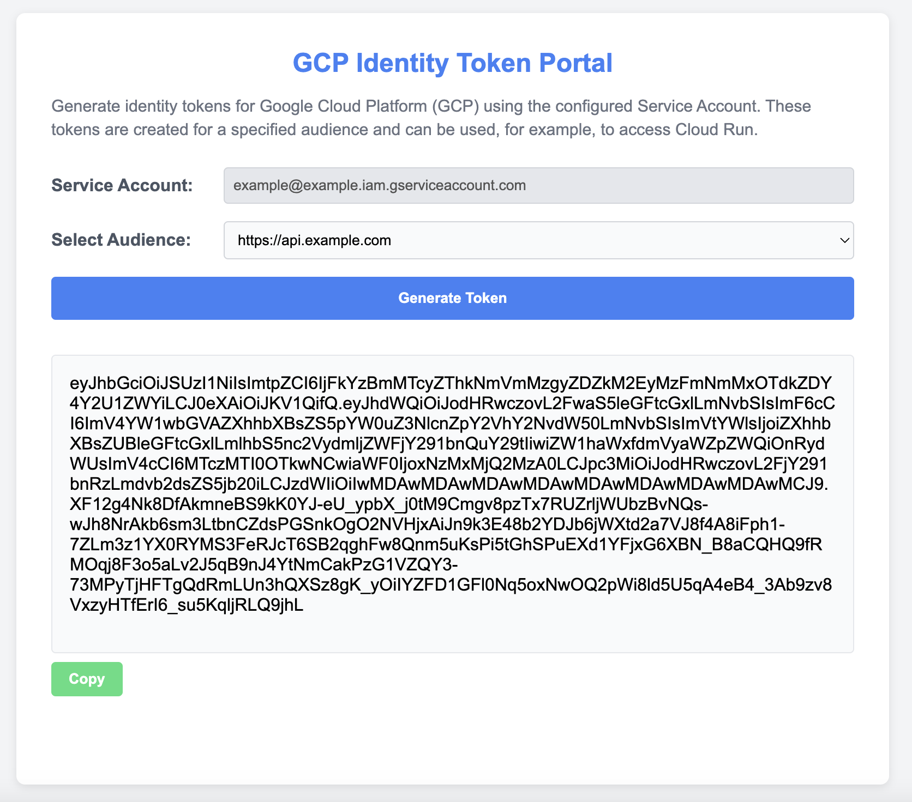

[](https://github.com/UnitVectorY-Labs/gcpidentitytokenportal/releases/latest) [](https://opensource.org/licenses/MIT) [](https://guide.unitvectorylabs.com/bestpractices/status/#active) [](https://goreportcard.com/report/github.com/UnitVectorY-Labs/gcpidentitytokenportal)

# gcpidentitytokenportal

Web portal for vending GCP identity tokens via metadata service with flexible audience selection.

## Overview

`gcpidentitytokenportal` is a simple web application that provides an interface for vending GCP identity tokens with the ability to specify the audience. When running on GCP it can use the built in service account, outside of GCP you can specify the path to the JSON file for the service account, or on Kubernetes it can utilize Workload Identity Federation to impersonate a service account. This is useful for scenarios where you need to obtain a GCP identity token for testing or debugging purposes. The service account used to obtain the identity token is determined by the service account that the application is running as.



## Usage

The latest `gcpidentitytokenportal` Docker image is available for deployment from GitHub Packages at [ghcr.io/unitvectory-labs/gcpidentitytokenportal](https://github.com/UnitVectorY-Labs/gcpidentitytokenportal/pkgs/container/gcpidentitytokenportal).

The application can be run outside of GCP using the following command:

```bash
docker run --name gcpidentitytokenportal -d -p 8080:8080 \
  -v /path/to/your-service-account-key.json:/creds.json \
  -v /path/to/your-config.yaml:/config.yaml \
  -e GOOGLE_APPLICATION_CREDENTIALS=/creds.json \
  ghcr.io/unitvectory-labs/gcpidentitytokenportal:v0.4.0
```

This application is intended to run on GCP in an environment such as Cloud Run.

No special permissions are required to run this application. The service account under which the application runs will be used to obtain the identity token. The recipient system must verify the token using Google's public keys. Any resource access permissions are determined by the service account running the application, but these permissions are not required to obtain the identity token.

## Configuration

This application is configured using environment variables:

- `GOOGLE_APPLICATION_CREDENTIALS`: (Optional) The path to your Google Cloud service account key file. If not provided and running on GCP, the application will use the default service account credentials. If not provided and not running on GCP, the application will fail to start.
- `PORT`: The port on which the server listens (default: 8080).

When running the Docker container and using `GOOGLE_APPLICATION_CREDENTIALS` to set the path to the credentials file, this path will be for the file in the container, therefore you will need to mount the file from the host machine to the container. This can be done by using the `-v` flag when running the container. A path such as `/config.yaml` can be used to mount the file and then `GOOGLE_APPLICATION_CREDENTIALS=/config.yaml` can be used to set the environment variable.

By default, any audience can be specified. To restrict audiences, mount a YAML file to the container at `/config.yaml` with `audiences` defined as a list of allowed values:

```yaml
# These audiences will be provided as options in the dropdown menu
audiences:
  - https://api.example.com
  - https://service.example.com
```

## Kubernetes with Workload Identity Federation & Account Impersonation

When running this application in a Kubernetes cluster, you can use the Kubernetes service account token to impersonate a service account with the necessary permissions to obtain the identity token even when not running on GKE. This assumes that Workload Identity Federation has been configured for the cluster including the public key for Kubernetes registered with the Workload Identity Pool.

Once that is done, **gcpidentitytokenportal** can be configured to use Google's syntax for impersonation. The following is an example of a ConfigMap and Deployment that can be used to run the application in a Kubernetes cluster:

```yaml
apiVersion: v1
kind: ConfigMap
metadata:
  name: gcp-wif-config
data:
  credential-configuration.json: |
    {
      "universe_domain": "googleapis.com",
      "type": "external_account",
      "audience": "//iam.googleapis.com/projects/<PROJECT_NUMBER>/locations/global/workloadIdentityPools/<POOL_NAME>/providers/<PROVIDER_NAME>",
      "subject_token_type": "urn:ietf:params:oauth:token-type:jwt",
      "token_url": "https://sts.googleapis.com/v1/token",
      "credential_source": {
        "file": "/var/run/secrets/tokens/gcp-token",
        "format": {
          "type": "text"
        }
      },
      "service_account_impersonation_url": "https://iamcredentials.googleapis.com/v1/projects/-/serviceAccounts/<SERVICE_ACCOUNT_EMAIL>:generateAccessToken"
    }
```

Be sure to replace the placeholder values with your specific configuration settings including `<PROJECT_NUMBER>`, `<POOL_NAME>`, `<PROVIDER_NAME>`, and `<SERVICE_ACCOUNT_EMAIL>`.

This `credential-configuration.json` in the config map contains no secrets and is mounted as a volume in the deployment and is used to obtain the identity token.

The following is an example of a Deployment that can be used to run the application in a Kubernetes cluster ouside of GKE that is configured with Workload Identity Federation:

```yaml
apiVersion: apps/v1
kind: Deployment
metadata:
  name: gcpidentitytokenportal
  namespace: default
spec:
  replicas: 1
  selector:
    matchLabels:
      app: gcpidentitytokenportal
  template:
    metadata:
      labels:
        app: gcpidentitytokenportal
    spec:
      serviceAccountName: <KUBERNETES_SERVICE_ACCOUNT_NAME>
      containers:
        - name: gcpidentitytokenportal
          image: ghcr.io/unitvectory-labs/gcpidentitytokenportal:v0.4.0
          ports:
            - containerPort: 8080
          env:
            - name: GOOGLE_APPLICATION_CREDENTIALS
              value: "/etc/workload-identity/credential-configuration.json"
          volumeMounts:
            - mountPath: /var/run/secrets/tokens
              name: token-volume
              readOnly: true
            - name: workload-identity-credential-configuration
              mountPath: "/etc/workload-identity"
              readOnly: true
      volumes:
        - name: token-volume
          projected:
            sources:
              - serviceAccountToken:
                  path: gcp-token
                  expirationSeconds: 3600
                  audience: https://iam.googleapis.com/projects/<PROJECT_NUMBER>/locations/global/workloadIdentityPools/<POOL_NAME>/providers/<PROVIDER_NAME>
        - name: workload-identity-credential-configuration
          configMap:
            name: gcp-wif-config
```

Be sure to replace the placeholder values with your specific configuration settings including `<PROJECT_NUMBER>`, `<POOL_NAME>`, `<PROVIDER_NAME>`, and `<KUBERNETES_SERVICE_ACCOUNT_NAME>`.

In order for this to work the service account that we are impersonating needs to have the `Workload Identity User` grant the principal for the Workload Identiy Federation. This principal is in the following format: `principal://iam.googleapis.com/projects/<PROJECT_NUMBER>/locations/global/workloadIdentityPools/<POOL_NAME>/subject/system:serviceaccount:<NAMESPACE>:<KUBERNETES_SERVICE_ACCOUNT_NAME>`

## Logging Configuration

The application supports structured logging with configurable levels and formats for improved observability in production environments.

### Environment Variables

| Variable | Description | Default | Options |
|----------|-------------|---------|---------|
| `LOG_LEVEL` | Controls the verbosity of log output | `info` | `debug`, `info`, `warn`, `error` |
| `LOG_FORMAT` | Log output format | `json` | `json`, `text` |
| `ENABLE_DEBUG_ENDPOINTS` | Enables the `/debugz` endpoint | `false` | `true`, `false` |

### Log Format

**JSON format (default)** - Recommended for Kubernetes/production environments:
```json
{"timestamp":"2024-01-15T10:30:00Z","severity":"info","component":"startup","message":"server starting","fields":{"port":"8080","mode":"impersonation"}}
```

**Text format** - Recommended for local development:
```
2024-01-15T10:30:00Z [INFO] [startup] server starting port=8080 mode=impersonation
```

### Log Components

Logs are organized by component for easy filtering:

- `startup` - Application initialization and configuration loading
- `http` - HTTP request/response logging
- `token` - Token generation operations
- `sts` - STS token exchange operations
- `iam` - IAM identity token generation
- `ui` - Template rendering

### Request Correlation

Every HTTP request is assigned a unique `request_id` for tracing:

1. If the `X-Request-Id` header is provided, that value is used
2. Otherwise, a new UUID is generated

The `request_id` is:
- Included in all log entries for that request
- Returned in the `X-Request-Id` response header
- Included in error messages returned to the client

Example usage with curl:
```bash
curl -H "X-Request-Id: my-trace-id-123" http://localhost:8080/token
```

## Health and Diagnostics Endpoints

### GET /healthz

Simple liveness probe. Returns `200 OK` with body `ok` if the server is running.

```bash
curl http://localhost:8080/healthz
# Response: ok
```

### GET /readyz

Readiness probe. Returns `200 OK` only if:
- Template is loaded
- Configuration is parsed
- Credentials file exists (when required)

```bash
curl http://localhost:8080/readyz
# Response: ok (or 503 with error message)
```

### GET /debugz (Optional)

Diagnostics endpoint providing non-sensitive configuration details. **Disabled by default.**

Enable with: `ENABLE_DEBUG_ENDPOINTS=true`

```bash
curl http://localhost:8080/debugz
```

Response:
```json
{
  "mode": "impersonation",
  "impersonation_email": "my-sa@project.iam.gserviceaccount.com",
  "wif_audience": "//iam.googleapis.com/projects/123/locations/global/workloadIdentityPools/pool/providers/provider",
  "token_file_exists": true,
  "token_file_readable": true,
  "config_exists": true,
  "allowed_audiences_count": 2
}
```

## Troubleshooting Guide

### Using Request IDs for Debugging

When an error occurs, the response includes a `request_id`. Use this to find the corresponding log entries:

```bash
# Example error response
Failed to get identity token. request_id=abc123-def456

# Search logs (in Kubernetes)
kubectl logs deployment/gcpidentitytokenportal | grep "abc123-def456"
```

### Common Error Patterns

#### STS Token Exchange Errors

| Error Category | HTTP Status | Typical Cause |
|----------------|-------------|---------------|
| `STS_HTTP_ERROR` | N/A | Network connectivity issues to `sts.googleapis.com` |
| `STS_NON_200` | 400 | Audience mismatch in WIF configuration |
| `STS_NON_200` | 403 | Pool/provider/condition rejection |
| `STS_EMPTY_ACCESS_TOKEN` | 200 | Unexpected empty response from STS |

**Example: Audience mismatch (STS 400)**
```
audience configured in the projected token doesn't match the WIF provider audience
```

**Solution**: Verify the `audience` in your Kubernetes projected token matches the WIF provider configuration.

#### IAM Credentials Errors

| Error Category | HTTP Status | Typical Cause |
|----------------|-------------|---------------|
| `IAM_HTTP_ERROR` | N/A | Network connectivity issues to `iamcredentials.googleapis.com` |
| `IAM_NON_200` | 403 | Missing `roles/iam.serviceAccountTokenCreator` or `roles/iam.workloadIdentityUser` |
| `IAM_NON_200` | 404 | Service account doesn't exist |
| `IAM_EMPTY_TOKEN` | 200 | Unexpected empty response from IAM |

**Example: Missing permissions (IAM 403)**
```
Permission 'iam.serviceAccounts.getOpenIdToken' denied on resource
```

**Solution**: Grant the Workload Identity principal the `Workload Identity User` role on the target service account.

#### Network Errors

| Error Category | Typical Cause |
|----------------|---------------|
| `NETWORK_DNS_ERROR` | DNS resolution failure (check egress policies) |
| `NETWORK_TIMEOUT` | Connection timeout (firewall or network policy blocking) |
| `TOKEN_FILE_READ_ERROR` | Kubernetes projected token volume not mounted |

#### Configuration Errors

| Error Category | Typical Cause |
|----------------|---------------|
| `CONFIG_MISSING` | Required configuration file not found |
| `CONFIG_PARSE_ERROR` | Invalid YAML/JSON in configuration |
| `AUDIENCE_INVALID` | Selected audience not in allowed list |

### Debugging Steps

1. **Enable debug logging temporarily**:
   ```bash
   kubectl set env deployment/gcpidentitytokenportal LOG_LEVEL=debug
   ```

2. **Enable debug endpoint temporarily**:
   ```bash
   kubectl set env deployment/gcpidentitytokenportal ENABLE_DEBUG_ENDPOINTS=true
   ```

3. **Check configuration with debugz**:
   ```bash
   kubectl port-forward deployment/gcpidentitytokenportal 8080:8080
   curl http://localhost:8080/debugz
   ```

4. **Verify token file is mounted and readable** (from debugz output):
   ```json
   {
     "token_file_exists": true,
     "token_file_readable": true
   }
   ```

5. **Review logs with request ID**:
   ```bash
   curl -v -H "X-Request-Id: debug-123" -X POST \
     -d "audience=https://my-service.example.com" \
     http://localhost:8080/token
   
   kubectl logs deployment/gcpidentitytokenportal | grep "debug-123"
   ```

### Security Note

Debug endpoints and verbose logging should be disabled in production after troubleshooting:

```bash
kubectl set env deployment/gcpidentitytokenportal LOG_LEVEL=info ENABLE_DEBUG_ENDPOINTS-
```

**Never log or expose:**
- Kubernetes service account tokens
- STS access tokens
- Identity tokens
- Authorization headers
